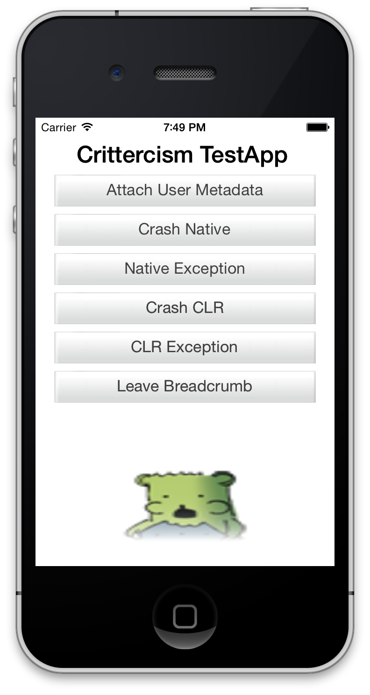
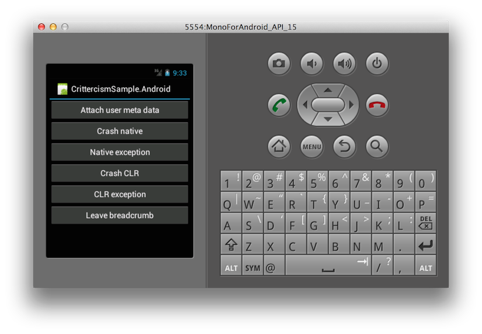

Xamarin, Crittercism Component Package
=======

**Work In Progresss**

Performance Monitor, prioritize, troubleshoot, and trend your mobile cross-platform [Xamarin](http://xamarin.com) mobile app with [Crittercism](http://crittercism.com) C# Component.

A cross-platform Component for leveraging Crittercism SDK and Services from Xamarin ( Mono  C# ) iOS and Android Applicaion

Please read Getting Started to learn how to use the component library.

##Crittercism API

Crittercism API (iOS and Android )

- Init
	- (iOS) void Crittercism.Init(string appId)
	- (android) void Init(Context appContext, string appId)
- void Crittercism.LeaveBreadcrumb(string breadcrumb)
- void Crittercism.SetMetadata(string key, string value)
- void Crittercism.SetUserName(string username)
- bool Crittercism.DidCrashOnLastLoad()	
- void Crittercism.LogUnHandledException(System.Exception e)
- void Crittercism.LogHandledException(System.Exception e)

##Getting Started

###Prerequisities

- Xamarin Studio in your developer machine, you can download it from [Xamarin.com/download](http://xamarin.com/download).
- Native Tools for iOS and Android
- [Crittercism](http://crittercism.com) Account and Application Keys


###Getting Started with Android

1. Create a new Xamarin Android Project
1. Add the Crittercsim Library
1. Import namespace `using Com.Crittercism.App;`
1. Configure Manifest Provisions for [Xamarin Android Applicaion configuration](/screenshots/Xam-Android-Manifest.png)
	- <uses-permission android:name="android.permission.ACCESS_NETWORK_STATE"/>
	- <uses-permission android:name="android.permission.GET_TASKS"/>
	- <uses-permission android:name="android.permission.INTERNET"/>
	- <uses-permission android:name="android.permission.READ_LOGS"/>
1. Initialize Crittercism in `protected override void OnCreate (Bundle bundle)`

```
//Initialize Crittercism
Crittercism.Initialize( ApplicationContext, "537fc935b573f15751000002");

//Set the Username
Crittercism.SetUsername ("ANDROID_USER_NAME");

//Handle Exception

```

#### Mapping.txt file for Android
1. Uploading the mapping.txt File 

For more information regarding the Xamarin Android Crittercsim refer to the  [Crittercism docs](http://docs.crittercism.com/android/android.html)

###Getting Started with iOS

1. Create a new Xamarin iOS Project
1. Add the Crittercsim Library
1. Import namespace `using Crittercism;`
1. Configure correct Provisions for 
1. Initialize Crittercism 

For more information regarding the Xamarin Android Crittercsim refer to the  [Crittercism docs](http://docs.crittercism.com/android/ios.html)


### Dsym file for iOS


Crittercism will symbolicate any crashes reported by the Crittercism library that match a dSYM file you've uploaded. dSYM files are only available from the iOS Device ( ).

you can upload your dSYM file by dragging the zipped dSYM file into developers web dashboard or by running a script.

```
APP_ID="5342d5a70ee9483d74000007"
API_KEY="gkozoru9btnlxu870pa5w4vj1fwgfi36"
source ${SRCROOT}/CrittercismSDK/dsym_upload.sh
```

For more information regarding how to upload a Xamarin iOS Crittercsim refer to the  [Crittercism docs](http://docs.crittercism.com/ios/ios.html)


##Sample Application

Sample Application demonstrating using the Crittercsism Xamarin Component for iOS and Android

###iOS Sample Application



Open and run  the iOS Sample app located at `samples/CrittercismSample.iOS/CrittercismSample.iOS.sln`

###Android Sample Application



Open run the Android Sample app located at `samples/CrittercismSample.Android/CrittercismSample.Android.sln`


#Developer Notes

##Folder Hierarchy

- ```~/samples/``` iOS and android samples
- ```~/component/``` Xamarin Component folder.  Conform with the [Xamarin Template](https://github.com/xamarin/component-template)
- Build Scripts ```~/scripts/```


##Building and Updating the Xamarin Component

you can build all the projects in this repository by opening the Crittercism.Workspace `open ~/Crittercism.Workspace/Crittercism.mdw`

Instructions on building Xamarin.iOS and Xamarin.Android dlls and and the crittercism-1.0.xam component refer to the  [component README.md](/component/README.md )


##Testing User Storis

###iOS

[Xamarin-TestApp-iOS crash-summary ](https://app.crittercism.com/developers/crash-summary/5342d5a70ee9483d74000007)

```
App Name: Xamarin-TestApp-iOS
Crittercism App ID: 53433aee40ec926441000002
API Key: jgamwbghdxpe7kolfnruhyds10bcxvna

[Crittercism enableWithAppID:@"53433aee40ec926441000002"];
```


###Android 

[Xamarin-TestApp-Android crash-summary ](https://app.crittercism.com/developers/crash-summary/537fc935b573f15751000002)

```
App Name: Xamarin-TestApp-Android
Crittercism App ID: 537fc935b573f15751000002
API Key: CR0TyOGLxLe5u5cLnH4TGYo7z7yDiyyk

Crittercism.initialize(getApplicationContext(), "537fc935b573f15751000002");
```


##Developer Notes

### Build 

- Using Xamarin to Build
- using Build Scripts

### Test , User Test stories.

 - on Device Testing / Verification
 - Simulator Testing / Verification 

### Deploy 
 - packaging the libarary for Xamarin Store
 - Submitting to the Xamarin Store


### How to update Android libs Jar

### How to update the iOS .a libarary


##Release Notes

- Supports Xamarin 3.0
- Created Crittercism.Workspace with both the binding libraries and Sample Applications `~/Crittercism.Workspace/Crittercism.mdw`
- Updated README.md 
- Lots of little Clean up 
	- Removed the /docs folder ( branched from docs repo instead)
	- Removed the /misc folder


###Misc Notes

- [ ] CLR Stack tracing, clr update ( NSException - Hacky way ) 
	- C# Exceptions 
 	- logUnityException ( convert to the windows exception and sends to endpoint, as a Windows excption )
 	- hook global exception handler it into 
	- Diagnostics ( app version, battery, etc ... )
	- Check for an update on the unity library.
	- https://github.com/crittercism/crittercism-unity-ios/blob/feature/exception-cleanup/Plugins/Crittercism_IOS_Scripts/CrittercismIOS.cs#L169


