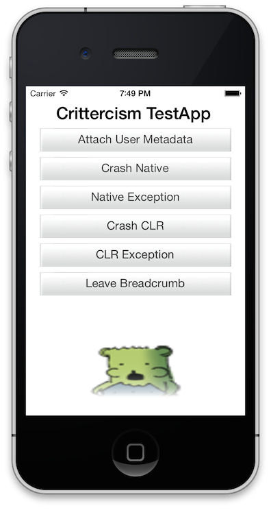

Apteligent (formerly Crittercism) Xamarin Component Package
=======

Performance Monitor, prioritize, troubleshoot, and trend your cross-platform [Xamarin](http://xamarin.com) mobile apps with the [Apteligent](http://crittercism.com) C# Component.

A cross-platform component for leveraging the Apteligent SDK and Services from Xamarin ( Mono  C# ) iOS and Android Applications

Please read Getting Started below to learn how to use the component library.

##Crittercism API

Crittercism API (iOS and Android )

- Init
	- (iOS) void Crittercism.Init(string appId)
	- (android) void Init(Context appContext, string appId)
- void Crittercism.LeaveBreadcrumb(string breadcrumb)
- void Crittercism.SetMetadata(string key, string value)
- void Crittercism.SetUserName(string username)
- bool Crittercism.DidCrashOnLastLoad()
- void Crittercism.LogUnHandledException(System.Exception e)
- void Crittercism.LogHandledException(System.Exception e)
- void Crittercism.BeginTransaction(string transactionName)
- void Crittercism.BeginTransaction(string transactionName, int transactionValue)
- void Crittercism.EndTransaction(string transactionName)
- void Crittercism.FailTransaction(string transactionName)
- void Crittercism.SetTransactionValue(string transactionName, transactionValue)
- int Crittercism.GetTransactionValue(string transactionName)


##Getting Started

###Prerequisities

- Xamarin Studio in your developer machine, you can download it from [Xamarin.com/download](http://xamarin.com/download).
- Native Tools for iOS and Android
- [Apteligent](http://www.apteligent.com) Account and Application Keys


###Getting Started with Android

1. Create a new Xamarin Android Project
1. Add the Crittercism Library
1. Import namespace `using Com.Crittercism.App;`
1. Configure Manifest Provisions for [Xamarin Android Application configuration](/screenshots/Xam-Android-Manifest.png)
```
	<uses-permission android:name="android.permission.ACCESS_NETWORK_STATE"/>
	<uses-permission android:name="android.permission.GET_TASKS"/>
	<uses-permission android:name="android.permission.INTERNET"/>
	<uses-permission android:name="android.permission.READ_LOGS"/>
```
1. Initialize Crittercism in `protected override void OnCreate (Bundle bundle)`

```
//Initialize Crittercism
Crittercism.Initialize( ApplicationContext, "537fc935b573f15751000002");

```
#### Mapping.txt file for Android
If you are using Proguard or Dexguard, you can upload your mapping files so that Apteligent will automatically symbolicate crashes: [Configuring Proguard Symbolication](https://docs.apteligent.com/android/android.html#configuring-proguard-symbolication)

For more information regarding the Apteligent Xamarin Android component refer to the [Apteligent docs](https://docs.apteligent.com/android/android.html)

###Getting Started with iOS

1. Create a new Xamarin iOS Project
1. Add the Crittercism Library
1. Import namespace `using Crittercism;`
1. Configure correct Provisions for
1. Initialize Crittercism

For more information regarding the Apteligent Xamarin iOS component refer to the [Apteligent docs](https://docs.apteligent.com/ios/ios.html)


### Dsym file for iOS


Crittercism will symbolicate any crashes reported by the Crittercism library that match a dSYM file you've uploaded. dSYM files are only available from the iOS Device ( ).

you can upload your dSYM file by dragging the zipped dSYM file into developers web dashboard or by running a script.

```
APP_ID="5342d5a70ee9483d74000007"
API_KEY="gkozoru9btnlxu870pa5w4vj1fwgfi36"
source ${SRCROOT}/CrittercismSDK/dsym_upload.sh
```

For more information regarding how to upload a Xamarin iOS Crittercism refer to the [Crittercism docs](https://docs.apteligent.com/ios/ios.html)


##Sample Application

Sample Application demonstrating using the Crittercism Xamarin Component for iOS and Android

###iOS Sample Application



Open and run the iOS Sample app located at `samples/CrittercismSample.iOS/CrittercismSample.iOS.sln`

###Android Sample Application


Open run the Android Sample app located at `samples/CrittercismSample.Android/CrittercismSample.Android.sln`


#Developer Notes

##Folder Hierarchy

- ```~/samples/``` iOS and android samples
- ```~/component/``` Xamarin Component folder.  Conform with the [Xamarin Template](https://github.com/xamarin/component-template)
- Build Scripts ```~/scripts/```


##Building and Updating the Xamarin Component

You can build all the projects in this repository by opening the Crittercism.Workspace `open ~/Crittercism.Workspace/Crittercism.mdw`

Instructions on building Xamarin.iOS and Xamarin.Android dlls and and the crittercism-1.0.xam component refer to the  [component README.md](/component/README.md )


##Developer Notes

### Build

- Using Xamarin to Build

Open Crittercism.Workspace/Crittercism.mdw in Xamarin Studio
(e.g. double click Crittercism.mdw in Finder).  "Rebuild All"
to clean and build again from scratch.  "Build All" to only
build sources which have changed.  "Build Crittercism.iOS" to
only build Crittercism.iOS sources which have changed.

- Using Build Scripts

sh scripts/build.sh
"run '../component/ and then rake' to build the component"
See component/README.md

### Deploy
- Submitting to the Xamarin Store

Email support@apteligent.com to upload the built Xamarin component to
https://components.xamarin.com/view/crittercism


### How to update Android libs Jar

Add new crittercism_TITANIUM_vX_X_X_sdkonly.jar to
Crittercism.Android/Jars folder.  Inside Xamarin Studio, on
the "Solution" tree control, "Delete" the old
crittercism_TITANIUM_vX_X_X_sdkonly.jar , and
"Add" the new crittercism_TITANIUM_vX_X_X_sdkonly.jar .

### How to update the iOS .a library

Add new libCrittercism_vX_X_X.a to Crittercism.iOS folder.
Inside Xamarin Studio, on the "Solution" tree control,
"Delete" the old libCrittercism_vX_X_X.a , and
"Add" the new libCrittercism_vX_X_X.a .  The "Add" operation
will automatically generate libCrittercism_vX_X_X.linkwith.cs
in the Crittercism.iOS folder .

